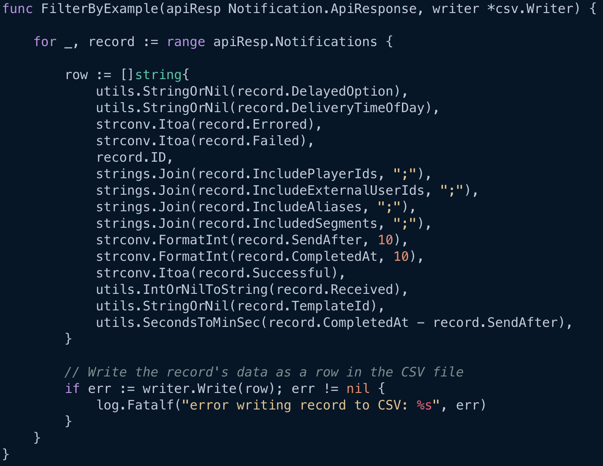
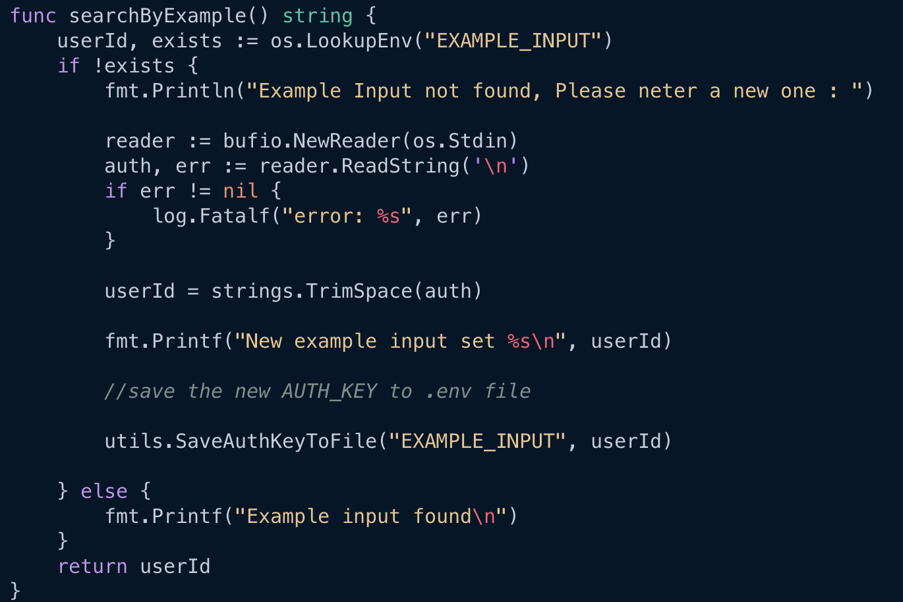
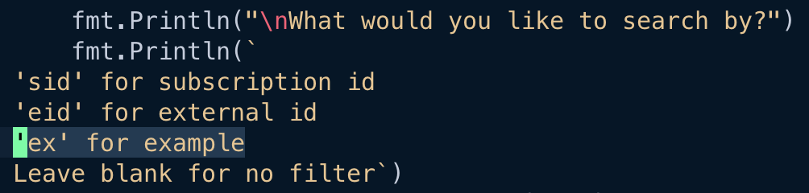
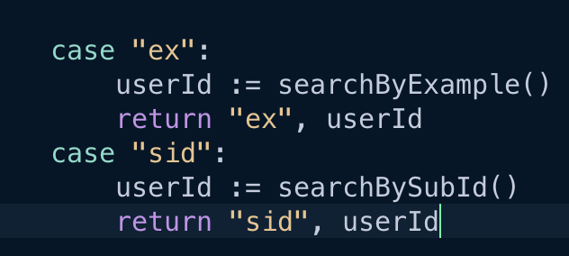
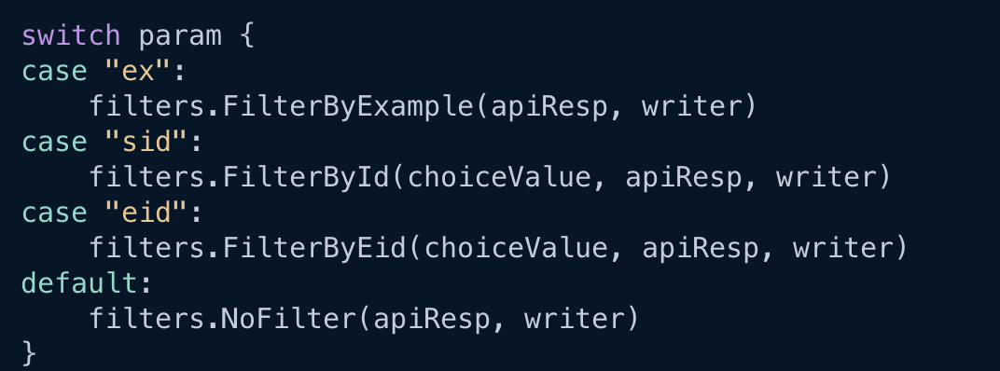
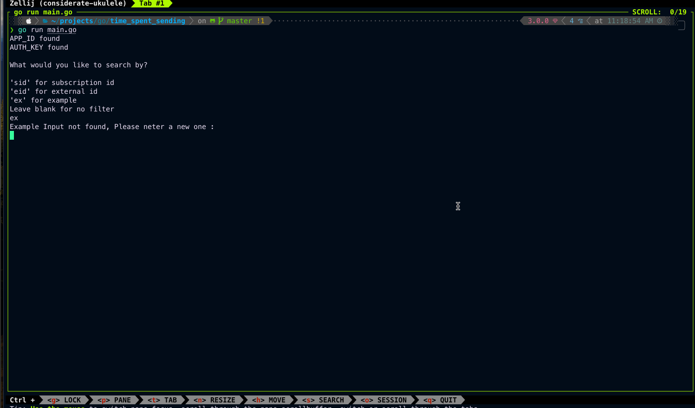

# Steps for adding filters
1. First you'll need to figure out if the filter is listed in the headers in main.go
```
 		"DelayedOption",
		"DeliveryTimeOfDay",
		"Errored",
		"Failed",
		"ID",
		"IncludePlayerIds",
		"IncludeExternalUserIds",
		"IncludeAliases",
		"IncludedSegments",
		"SendAfter",
		"CompletedAt",
		"Successful",
		"Received",
		"TemplateId",
		"TimeSentSpending",
```
2. Go to filter.go and copy the NoFilter function to work off of a blank slate
3. Reference the above examples in this file to see how filters are passed into the switch statement and the logic gates that should be used

4. In userChoice.go, add a search to parse the .env file for the specific value you're looking to input into the filter

5. Still in userChoice, go to the top and add a case that matches a string that the user can listen for, and add that to the stdnin fmt so the end user can input the keyword correctly

6. The case should call the search function you've created if met

7. In main.go, add the string you're user inputs to the switch statement to make the request fire off that specific filter function. 


The end UX should look like this : 



### Time Spent Sending is a custom column that is intended to show the time in minute and second difference between the "SendAfter" and "CompletedAt" values

### The notif.go structs are intended for the response parsing. If more columns are needed you'll need to add more properties to these structs and add headers to the headers slice in main.go

## TODO : 
- Add filtering and writing to the csv, to the response struct directly as methods
- Add platform stats as an additional struct to pass delivery data to
